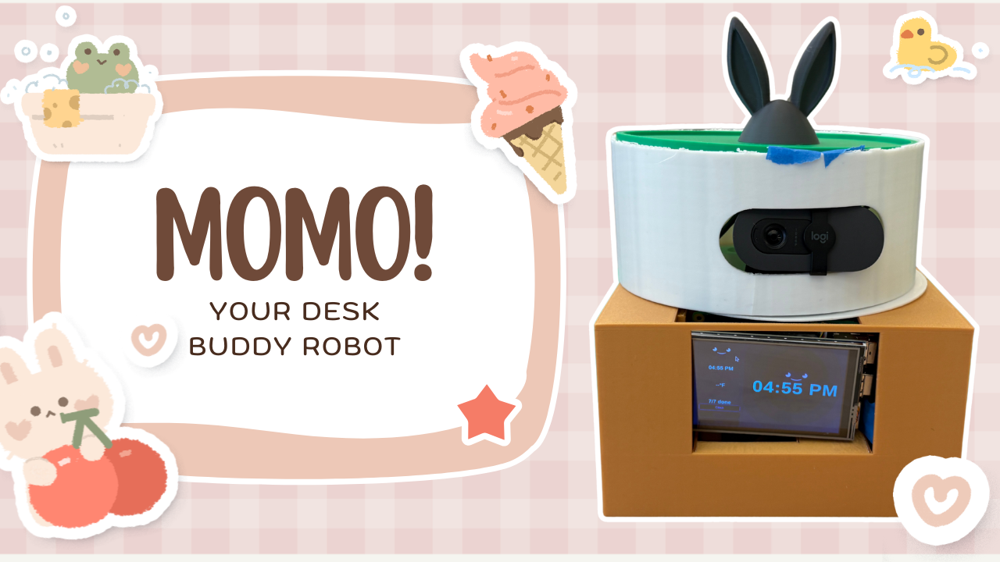

# Momo Desk Buddy



## SUPPLEMENTAL VIDEO WITH ALL FEATURES: https://youtu.be/XPpRgwov2V4?si=CCpBvkBGLM3RrtA2

## Teresa and Lisa Chou

Momo is a personal desk buddy robot designed to help users stay organized, productive, and engaged while working at their desk. It combines a Flask backend, web-based touch interface, voice commands, live weather, task management, Pomodoro timers, reminders, music playback, OpenCV camera tracking, and Arduino-controlled servo movement.

## Features

- Displays the current time and date
- Provides live weather for New Haven with clothing recommendations
- Lets users view, add, complete, and remove tasks
- Saves tasks using a JSON file so they persist after restarting
- Includes 25-minute and 5-minute Pomodoro timers
- Supports spoken reminders
- Gives daily summaries with time, weather, and pending tasks
- Responds to voice commands using the wake word “Momo”
- Tells jokes and uses a friendly robot personality
- Plays requested music and shows music controls
- Supports sleep and wake mode
- Uses OpenCV and a webcam to detect and track a person
- Sends movement commands to an Arduino-controlled servo
- Provides a touch interface for clock, weather, tasks, timers, and music controls

## System Overview

Momo uses a Flask backend as the main control center. It takes input from voice commands, the touch interface, and webcam/OpenCV detection. The backend updates a shared state dictionary that stores information such as the current screen, voice status, weather, tasks, timer, reminders, sleep mode, music status, presence detection, and servo angle. The frontend reads this state through Flask API routes and updates the display.

## Technologies Used

- Python
- Flask
- HTML/CSS/JavaScript
- JSON
- OpenCV
- Speech recognition
- Text-to-speech
- Python threading
- Arduino
- Servo motor
- Webcam
- Microphone and speaker
- `yt-dlp`, `ffmpeg`, `paplay`, or `aplay` for music playback

## Running the Project

First, open a terminal and move into the project folder:

```bash
cd momo_robot_desk_buddy
```

Activate the virtual environment:

```bash
source venv/bin/activate
```

Run the Flask app:

```bash
python app.py
```

Once the app starts, open the local Flask address shown in the terminal. By default, it runs at:

```text
http://0.0.0.0:5000
```

If you ssh, run `DISPLAY=:0 chromium --kiosk --window-size=480,320 --noerrdialogs --disable-infobars http://127.0.0.1:5000`

## Hardware Setup

Momo uses an Arduino and servo motor for physical movement. The Arduino listens for angle values sent from Python over a serial connection. The servo is attached to pin 9 and can move from 0 to 180 degrees. Python calculates the desired angle based on either voice commands or OpenCV face tracking, then sends that angle to the Arduino.

## Camera Tracking

The camera system runs in a background thread. It uses OpenCV to capture webcam frames, convert them to grayscale, detect a face or body, and compare the person’s position to the center of the frame. If the person is off-center, Momo adjusts the servo angle so the camera turns toward them. A dead zone is used to prevent jitter from tiny movements.

## Concurrency and Locking

Momo runs multiple features at the same time, including voice listening, timers, reminders, camera tracking, music playback, and Flask API updates. These features share one central state dictionary, so the program uses `state_lock` to make sure only one thread reads or updates shared data at a time. Slow operations, such as weather requests, speech playback, and music playback, are kept outside the lock so the system stays responsive.

## Project Structure

```text
momo_robot_desk_buddy/
│
├── app.py                 # Main Flask backend and system logic
├── tasks.json             # Saved task data
├── weather.py             # Weather fetching helper
├── ui.py                  # Earlier Pygame UI functions
├── index.html             # Web interface layout
├── arduino_code.txt       # Arduino servo code
├── arduino_code_test.py   # Servo test script
└── README.md              # Project instructions
```

## Notes

- Make sure the virtual environment is activated before running the app.
- Make sure the Arduino is connected before using servo movement.
- Make sure the webcam, microphone, and speaker are connected for camera tracking and voice features. --> its also important that the webcam and microphone are plugged into the right USB ports!
- Some features may require external tools such as `ffmpeg`, `yt-dlp`, `paplay`, or `aplay`.

## Future Improvements

- Improve computer vision with a stronger face tracking model
- Add a cleaner enclosure and better cable management
- Add more sensors or a pan-tilt camera system
- Connect Momo to calendar, email, or smart home tools
- Create a startup script so Momo runs automatically when powered on
